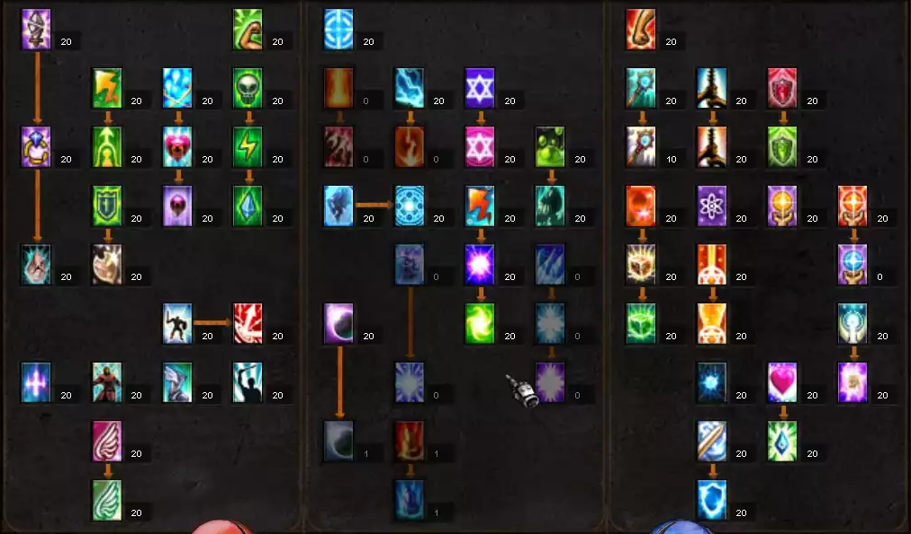

# DUEL
### Последние результаты
  

### Жанр
Логическая игра. "Три в ряд"

### Аудитория
В основном мужчины 20-35 лет

### Игровая сессия
Сражение 5-15 минут

### Сложность игры
Мидкор  
Правила известны, для победы необходима сложная комбинация простых действий.  
Легко научиться, сложно стать мастером.

### Идея
Игра в жанре "три в ряд". Игрок перед сражением составляет набор умений для персонажа. Умения взаимодействуют со всеми элементами игры (логика игры, поле, персонаж т.д.) изменяя ход сражения. Противником игрока являются другие игроки или группа игроков. 

### Мир игры
Мрачный фентезийный мир где преобладающая сила - магия. Маги из разных уголков мира каждый со своим стилем сражаются между собой за право быть первым.  
**Стилизация** - готика.  
**Эпоха** - средневековье.

### Примеры стиля графики
  

### Основная игровая механика
**Три в ряд** — cуть сводится к передвижению рун по игровому полю и составлению линий из трех и более элементов. Пространство, на котором располагаются руны, представляет собой поле из квадратов. Игрок выделяет две руны на игровом поле, которые меняются местами друг с другом. Перемена возможна лишь в том случае, когда перемещённая руна войдёт в состав новообразованной цепочки и являться соседней по горизонтальной или вертекальной оси. После чего цепочка разрушается, а руны которые находились выше пустых клеток опускаются. Свободное место на поле заполняется случайными рунами. Игрок может выбрать любую руну в состоянии ожидания. Особая комбинация руны дают бонусы игроку.

### Отличительная черта
Уникальный набор умений который выбирает игрок для персонажа, создавая собственный стиль игры. Умения дают новый игровой опыт для основной механики.

### Основной цикл игры
Убийство противников → Получение опыта и очков → Прокачка персонажа → Престиж  
Игрок убивает противников, собирая руны на поле и используя умения. Получая в награду опыт и золото, игрок прокачивает уровни своего персонажа и очки мастерства, открывая и улучшая активные и пассивные умения персонажа, увеличивая свою мощность.  
  
  

### Цикл сражения
Игроки по очереди делают ходы. На ход отводиться ораниченное время. За ход игрок может сделать несколько действий (использовать умения, собрать линии на поле). Умения могут изменять правила/логику основной игровой механики во время сражения.  
  
  

## Игровые объекты

### Игровое поле
Размер 6х6 квадратов.  
Состоит из рун.  

### Руны
Руны расположены на поле.  
Игрок может выбрать любую руну в состоянии ожидания.  
Игрок может менять местами руны только когда перемещённая руна войдёт в состав новообразованной цепочки и являться соседней по горизонтали или вертекали.  
При выборе не соседней руны она становиться выбранной.  
При перемещении руны не образующую цепочку руны меняются местами и возвращаются на свои места.

**Состояния** 
* Ожидание
* Выбранная - руна выбранная игроком 
* Активная - при выборе второй руны игроком, первая выбранная руна становиться активной
* Заблокированая - в состоянии блокировки руну невозможно использовать и уничтожить
* Разрушенная - руна состоявшая в линии

**Типы рун**  
* Атакующая - наносит урон противнику
* Исцеляющая - востанавливанет здоровье персонажу
* Элементаль - особая руна которая может образовывать линию с любым типом рун
* 1
* 2
* 3

### Линии и комбинации линий
Линией считается - расположенные в ряд 3 и более руны одного типа.

**Комбинации**  
Линии образуюшие 5 рун в ряд дают дополнительный ход во время сражения
Комбинации линий образованные из более чем 6 рун дают дополнительные очки энергии

### Персонаж
Персонаж - это управляемый игроком герой, олицетворяющий игрока.

**Атирбуты**  
* Имя - Игрок может дать персонажу имя. Имя Уникально, его можно в последствии неоднократно менять.
* Уровень - представляются числом, которые обозначают общее мастерство и опыт персонажа.
* Очки мастерства - используются для открытия и улучшения активных и пассивных умений персонажа.
* Набор умений - набор активных и пассивных умений персонажа.

**Характеристики**  
* Здоровье - определяет количество урона который может выдержать ваш персонаж
* Урон - увеличивает количество урона по противнику
* Лечение - увеличивает количество востанавлевыемых едениц здоровья
* Энергия - определяет количество получаемых едениц маны при сборе рун
  * 1 тип энергии
  * 2 тип энергии
  * 3 тип энергии
  * Сигма энергия (сумма всех типов энергии)
* Броня - определяет количество едениц блокироваемого урона
* Ярость - вероятность нанести двойной урон противнику
* Удача - вероятность получения дополнительного хода во время сражения
* Блок - вероятность полностью блокировать урон противника

### Умения
**Активное умение** - это умение, вручную применяемое игроком и дающее бонусы к боевым характеристикам персонажа и/или изменять правила/логику основной игровой механики во время сражения.  
Для использования умения требуется энергия типа указаного в атирбутах умения.  
Игрок может улучшать умения за очки мастерства, изменяя атрибуты умений.  
Умения имеют ограниченный период действия, а также кол-во ходов перезарядки, во время которого они недоступны. Может досрочно заканчивать ход.

**Пассивный умение** - это умение аналогично активному,но умение дейстивует на протяжении всего сражения и не имеет перезарядки. Пассивное умение не может заканчивать ход.

**Атирбуты**  
* Номер
* Имя
* Описание
* Стоимость очков мастерства
* Кол-во ходов действия
* Прерзарядка
* Тип энергии
* Вид
* Класс
* Место в дереве умений (?)

**Состояния в сражении**  
* Не активное - (?)
* Выбранное - доступоное игроку в сражении
* Активное - (?)
* На перезарядке - не доступоное игроку определенное кол-во ходов
* Заблокированное - не доступоное игроку определенное кол-во ходов

**Состояния в дереве умений**  
* Активное - доступное игроку для использования в сражении
* Не активное - не доступное игроку для использования в сражении

**Характеристики**  
Все характеристики индивидуальны для каждого умения. [таблица умений (?)]()

### Дерево умений
**Дерево умений** представляет из себя обширную сеть активных и пассивных умений.  
**Ветки дерева** - представляет из себя логику открытия умений  
**Листья дерева** - умения  
Игрок зарабатывает очки мастерства, которые он может тратить на листья дерева (умения).  
Для открытия умения необходимо достаточное количество очков мастерства и открыть все умения в вектке до необходимого умения.  
  
  
