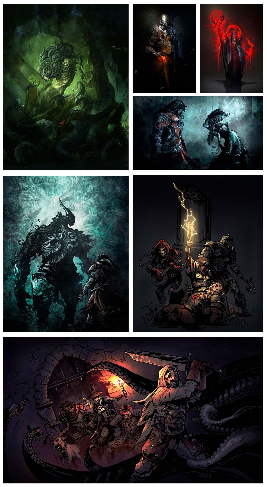
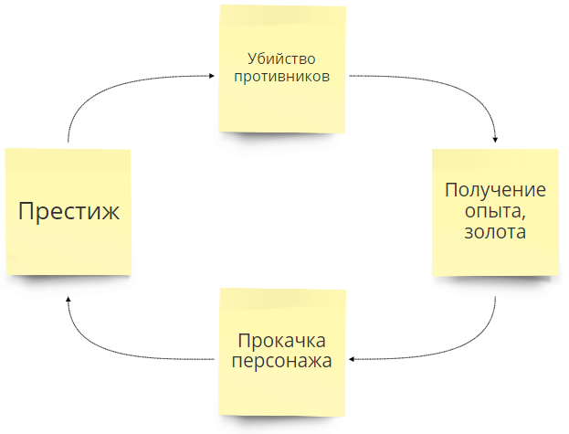
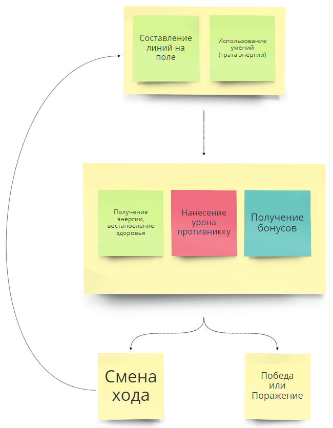

# Название игры (Duel / Duelium / ...)
### Оглавление
0. [Жанр](#1-Жанр)
0. [Аудитория](#2-Аудитория)
0. [Игровая сессия](#3-Игровая-сессия)
0. [Сложность игры](#4-Сложность-игры)
0. [Идея](#5-Идея)  
0. [Мир игры](#6-Мир-игры)  
0. [Графика](#7-Графика)  
  * [Стилистика рисования](#71-Стилистика-рисования)  
  * [Концепт арты](#72-Концепт-арты)  
0. [Основная игровая механика](#8-Основная-игровая-механика)  
0. [Отличительная черта](#9-Отличительная-черта)  
0. [Основной цикл игры](#10-Основной-цикл-игры)  
0. [Бой](#11-Бой)  
0. [Игровые объекты](#12-Игровые-объекты)  
  * [Игровое поле](#121-Игровое-поле)  
  * [Руны](#12-2-Руны)  
  * [Линии и комбинации линий](#123-Линии-и-комбинации-линий)  
  * [Персонаж](#12-4-Персонаж)  
  * [Умения](#12-5-Умения)  
  * [Дерево умений](#126-Дерево-умений)  
0. [Интерфейс](#13-Интерфейс)  
0. [Монетизация](#14-Монетизация)  

### Последние результаты
  

## 1 Жанр
Логическая игра - ["Три в ряд"](#8-Основная-игровая-механика)

## 2 Аудитория
В основном мужчины 20-35 лет

## 3 Игровая сессия
[Бой](#11-Бой) 5-15 минут

## 4 Сложность игры
Средняя  
Для победы необходима сложная комбинация простых действий.  
Легко научиться, сложно стать мастером.

## 5 Идея 
Игра в жанре ["три в ряд"](#8-Основная-игровая-механика). Игрок перед боем составляет набор [умений](#12-5-Умения) для [персонажа](#12-4-Персонаж). [Умения](#12-5-Умения) взаимодействуют со всеми элементами игры ([логика игры](#8-Основная-игровая-механика), [поле](#121-Игровое-поле), [персонаж](#12-4-Персонаж) т.д.) изменяя ход боя. Противником игрока являются другие игроки или группа игроков. 

## 6 Мир игры
Мрачный фентезийный мир. Действия начинаются после того как главный герой умирает бою в Мидгарде и попадает в Вальхаллу (в город Асгард). Каждый день с утра он облачается в доспехи и сражается насмерть, а после воскресает.
**Стилизация** - готика Cкандинавской мифологии.  
**Время** - 9-10 век.

## 7 Графика
### 7.1 Стилистика рисования
  

### 7.2 Концепт арты
  

## 8 Основная игровая механика
**Три в ряд** — cуть сводится к передвижению [рун](#12-2-Руны) по [игровому полю](#121-Игровое-поле) и составлению [линий](#123-Линии-и-комбинации-линий) из трех и более [рун](#12-2-Руны). Пространство, на котором располагаются [руны](#12-2-Руны), представляет собой [игровое поле](#121-Игровое-поле) из клеток. Игрок выделяет две [руны](#12-2-Руны) на [игровое поле](#121-Игровое-поле), которые меняются местами друг с другом. Перемена возможна лишь в том случае, когда перемещённая [руна](#12-2-Руны) войдёт в состав новообразованной [линии](#123-Линии-и-комбинации-линий) и являться соседней по горизонтальной или вертекальной оси. После чего [линия](#123-Линии-и-комбинации-линий) разрушается, а [руны](#12-2-Руны) которые находились выше пустых клеток опускаются. Свободное место на поле заполняется случайными [рунами](#12-2-Руны). Особые [комбинации линий](#123-Линии-и-комбинации-линий) [рун](#12-2-Руны) дают бонусы игроку.

## 9 Отличительная черта
Уникальный набор [умений](#12-5-Умения) который выбирает игрок для [персонажа](#12-4-Персонаж), создавая собственный стиль игры. [Умения](#12-5-Умения) дают новый игровой опыт для [основная  механики](#8-Основная-игровая-механика).

## 10 Основной цикл игры
Убийство противников → Получение опыта и очков → Прокачка персонажа → Престиж  
Игрок убивает противников, передвигая [руны](#12-2-Руны) на [поле](#121-Игровое-поле) и используя [умения](#12-5-Умения). Получая в награду опыт и золото, игрок прокачивает уровнь своего [персонажа](#12-4-Персонаж) и очки мастерства для открытия и улучшения активных и пассивных [умений](#12-5-Умения) [персонажа](#12-4-Персонаж), увеличивая свою мощность.  
  
  

## 11 Бой
Игроки боя делают ходы по очереди, передвигая [руны](#12-2-Руны). Право первого хода в бою выдается **случайно**. На выбор действий каждый ход дается 30 секунд.  Игрок может составить [линии и комбинации линий](#123-Линии-и-комбинации-линий) из [рун](#12-2-Руны). Также можно получить дополнительные бонусы которые зависят от [характеристик персонажа](#12-4-Персонаж). Игроки могут использовать [умения](#12-5-Умения), чтобы получить какое-либо преимущество. Если игрок не успевает выполнить действие, завершающее ход (составить линию из рун, использовать соответствующее умение и т.д.), то ход автоматически переходит противнику. Немаловажным элементом любого боя, способным в корне изменить исход боя, являются [умения](#12-5-Умения). Их надо выбрать для персонажа до начала боя в [дереве умений](#126-Дерево-умений). На применение умений расходуется энергия.  Бой ведется до того момента, пока здоровье одного из игроков не упадет до нуля.  За победу выдаются очки опыта, и игровое золото.
  
  

## 12 Игровые объекты

### 12.1 Игровое поле
Размер 6х6 клеток.  
Состоит из рун.  

### 12.2 Руны
Руны расположены на [игровом поле](#121-Игровое-поле).  
Руны энергии дает соответствующий тип энергии.
Игрок может выбрать любую *доступную* руну.  
Игрок может менять местами руны только когда перемещённая руна войдёт в состав новообразованной [линии](#123-Линии-и-комбинации-линий) и являться соседней по горизонтали или вертекали.  
При выборе не соседней руны она становиться *активная*.  
При перемещении руны не образующую [линию](#123-Линии-и-комбинации-линий) руны меняются местами и возвращаются на свои места.

**Состояния** 
* Доступна
* Активная - первая выбранная игроком руна
* Выбранная - вторая выбранная игроком руна
* Заблокированая - в состоянии блокировки руну невозможно использовать и уничтожить
* Разрушенная - руна состоявшая в линии, руну невозможно использовать

**Типы**  
* Атакующая (черная) - наносит урон противнику
* Исцеляющая (красная) - востанавливанет здоровье персонажу
* Элементаль (радуга) - особая руна которая может образовывать линию с любым типом рун
* Зеленая - дает энергию зеленого типа
* Синяя - дает энергию синего типа
* Желтая - дает энергию желтого типа

### 12.3 Линии и комбинации линий
Линией считается - расположенные в ряд 3 и более руны одного типа.

**Комбинации**  
* Линии образуюшие 5 рун в ряд дают дополнительный ход во время боя.  
* Комбинации линий образуюшие более 6 рун дают дополнительные очки энергии/урона/лечения

### 12.4 Персонаж
Персонаж - это управляемый игроком герой, олицетворяющий игрока.  

**Атрибуты**  
* Имя - Игрок может дать персонажу имя. Имя Уникально, его можно в последствии неоднократно менять.
* Опыт - (?)
* Золото - (?)
* Уровень - представляются числом, которые обозначают общий опыт персонажа.
* Очки мастерства - (?) используются для открытия и улучшения активных и пассивных умений персонажа.
* Набор умений - (?) набор активных и пассивных умений персонажа. Набор умений может включать в себя до 8 активных и 8 пассивных умений.  

**Характеристики**  
* Здоровье - определяет количество урона который может выдержать ваш персонаж
* Урон - увеличивает количество урона по противнику
* Лечение - увеличивает количество востанавлевыемых едениц здоровья
* Энергия - определяет количество получаемых едениц энергии при сборе рун
  * 1 Сигма энергия (сумма всех типов энергии)
  * 2 Зеленая тип энергии
  * 3 Синяя тип энергии
  * 4 Желтая тип энергии
* Броня - определяет количество едениц блокироваемого урона
* Ярость - вероятность нанести двойной урон противнику
* Удача - вероятность получения дополнительного хода во время боя
* Блок - вероятность полностью блокировать урон противника

### 12.5 Умения 
**Активное умение** - это умение, вручную применяемое игроком и дающее бонусы к характеристикам [персонажа](#12-4-Персонаж), а так же может изменять правила или логику [основной игровой механики](#8-Основная-игровая-механика) во время [боя](#11-Бой).  
Для использования умения требуется энергия типа указаного в атирбутах умения.  
Игрок может улучшать умения за очки мастерства в [дереве умений](#126-Дерево-умений).  
Умения имеют ограниченный *период действия*, а также *количество ходов перезарядки*, во время которого они недоступны. Умение может **досрочно заканчивать ход**.

**Пассивный умение** - это умение аналогично активному, но умение дейстивует на протяжении всего боя и не имеет перезарядки. Пассивное умение не может заканчивать ход.

**Атирбуты**
* Название - название умения
* Описание - полное описание действия умения
* Длительность - длительность умения в ходах
* Прерзарядка - количество ходов когда умение будет не доступно
* Переход хода - заканчивает ли умение досрочно ход?
* Время использования (?)
* Событие срабатывания (?)
* Взаимодействие с полем (?)
* Очков мастерства - необходимое количество отчков мастерства для добавления в набор умений
* Энергия - необходимое количество и тип энергии

**Состояния умений в бою**  
* Доступное - доступоное игроку в бою
* Не активное - не применяет в данный момент эффекты
* Активное - применяет эффекты на протяжении хода
* На перезарядке - не доступоное игроку определенное количество ходов
* Заблокированное - не доступоное игроку определенное количество ходов или из за нехватки энергии

**Состояния умений в дереве умений**  
* Активное - доступное игроку для использования в бою
* Не активное - не доступное игроку для использования в бою

**Характеристики**  
Все характеристики индивидуальны для каждого умения. [**Таблица умений**](https://docs.google.com/spreadsheets/d/17mzF-c6nYp4Hi2gjWXxZQdOzI8Q7LxrErgD9JgYMqrw/edit?usp=sharing)

### 12.6 Дерево умений (?? ТРЕБУЕТ ПЕРЕРАБОТКИ)
**Дерево умений** представляет из себя обширную сеть активных и пассивных умений.  
**Ветки дерева** - представляет из себя логику открытия умений  
**Листья дерева** - умения  
Игрок зарабатывает очки мастерства, которые он может тратить на листья дерева (умения).  
Для открытия умения необходимо достаточное количество очков мастерства и открыть все умения в вектке до необходимого умения.  
  
  

## 13 Интерфейс
[RealTimeBoard - interface](https://realtimeboard.com/app/board/o9J_k0DLCvk=/)  
**Дерево умений**(?)  
**Бой**(?)  
**Награда**(?)  
**Доска лидеров**(?)  
**Персонаж**(?)

## 14 Монетизация
**Модель free-to-play**.  
Продажа паков премиум валюты, которую игрок может потратить на:
* покупку бустеров, которые действуют определенное количество времени, добавляя бонус опыта и золота
* покупку сундуков с рандомными образами

**Модель freemium**.  
Ограничен максимальный уровень