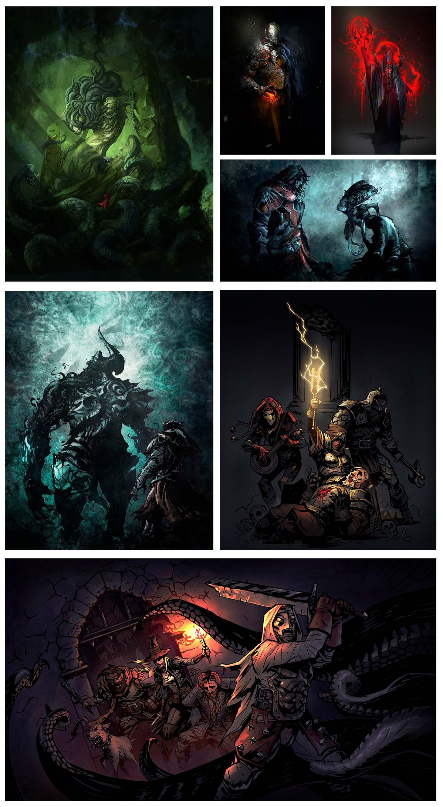
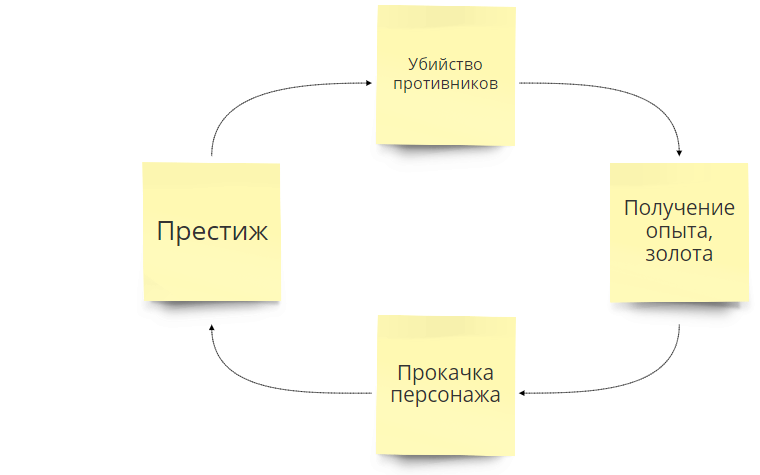
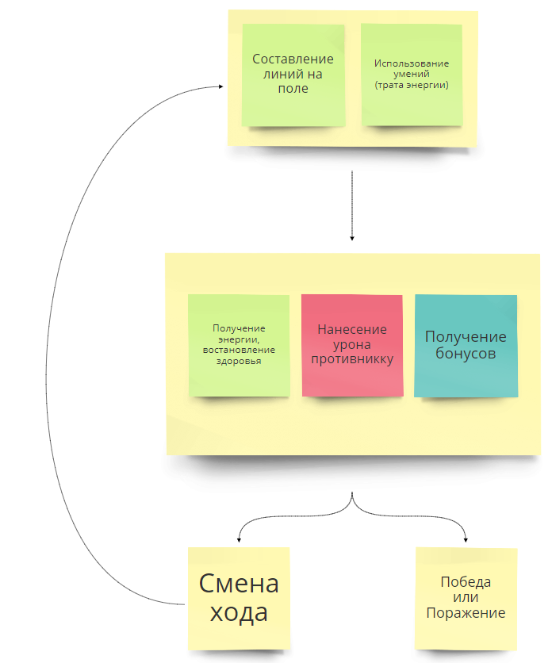

# Duel
## Оглавление
-   [Жанр](#Жанр)  
-   [Аудитория](#Аудитория)  
-   [Игровая сессия](#Игровая-сессия)  
-   [Сложность игры](#Сложность-игры)  
-   [Идея](#Идея)  
-   [Мир игры](#Мир-игры) | [полная версия](setting.md)  
-   [Графика](#Графика)  
    -   [Стилистика рисования](#Стилистика-рисования)
    -   [Концепт арты](#Концепт-арты)
-   [Основная игровая механика](#Основная-игровая-механика)
-   [Отличительная черта](#Отличительная-черта)
-   [Основной цикл игры](#Основной-цикл-игры)
-   [Бой](#Бой)
-   [Игровые объекты](#Игровые-объекты)
    -   [Игровое поле](#Игровое-поле)
    -   [Руны](#Руны)
    -   [Линии и комбинации линий](#Линии-и-комбинации-линий)
    -   [Персонаж](#Персонаж)
        -   [Энергия](#Энергия)
        -   [Урон](#Урон)
        -   [Лечение](#Лечение)
        -   [Броня](#Броня)
        -   [Ярость](#Ярость)
        -   [Удача](#Удача)
        -   [Блок](#Блок)
    -   [Умения](#Умения)
-   [Аккаунт](#Аккаунт)
    -   [Персонаж](#Персонаж)
    -   [Уровень](#Уровень)
    -   [Опыт](#Опыт)
    -   [Карма](#Карма)
    -   [Рейтинг](#Рейтинг)
    -   [Золото](#Золото)
    -   [Очки мастерства](#Очки-мастерства)
    -   [Список умений](#Список-умений)
-   [Интерфейс](#Интерфейс)
-   [Монетизация](#Монетизация)
-   [**Техническая часть**](https://github.com/Findoss/Duel/wiki)

### Последние результаты

## Жанр
Логическая игра - ["Три в ряд"](#Основная-игровая-механика)

## Аудитория
В основном мужчины 15-35 лет

## Игровая сессия
[Бой](#Бой) 5-15 минут

## Сложность игры
Средняя
Для победы необходима сложная комбинация простых действий.
Легко научиться, сложно стать мастером.

## Идея
Игра в жанре ["три в ряд"](#Основная-игровая-механика). Игрок перед боем составляет набор [умений](#Умения) для [персонажа](#Персонаж). [Умения](#Умения) взаимодействуют со всеми элементами игры ([логика игры](#Основная-игровая-механика), [поле](#Игровое-поле), [персонаж](#Персонаж) т.д.) изменяя ход боя. Противником игрока являются другие игроки или группа игроков.

## Мир игры
**Стилизация** - готика.  
**Время** - 9-10 век.  
COMBAK - Мир игры
[Читать полную версию](setting.md)

## Графика
### Стилистика рисования

### Концепт арты

## Основная игровая механика
**Три в ряд** — cуть сводится к передвижению [рун](#Руны) по [игровому полю](#Игровое-поле) и составлению [линий](#Линии-и-комбинации-линий) из трех и более [рун](#Руны). Пространство, на котором располагаются [руны](#Руны), представляет собой [игровое поле](#Игровое-поле) из клеток. Игрок выделяет две [руны](#Руны) на [игровом поле](#Игровое-поле), которые меняются местами друг с другом. Перемена возможна лишь в том случае, когда перемещённая [руна](#Руны) войдёт в состав новообразованной [линии](#Линии-и-комбинации-линий) и являться соседней по горизонтальной или вертекальной оси. После чего [линия](#Линии-и-комбинации-линий) разрушается, а [руны](#Руны) которые находились выше пустых клеток опускаются. Свободное место на поле заполняется случайными [рунами](#Руны). Особые [комбинации линий](#Линии-и-комбинации-линий) [рун](#Руны) дают бонусы игроку.

## Отличительная черта
Уникальный набор [умений](#Умения) который выбирает игрок для [персонажа](#Персонаж), создавая собственный стиль игры. [Умения](#Умения) дают новый игровой опыт для [основной механики](#Основная-игровая-механика).

## Основной цикл игры
Убийство противников → Получение опыта и очков → Прокачка персонажа → Престиж
Игрок убивает противников, передвигая [руны](#Руны) на [поле](#Игровое-поле) и используя [умения](#Умения). Получая в награду опыт и золото, игрок прокачивает уровнь своего [персонажа](#Персонаж) и очки мастерства для открытия и улучшения [умений](#Умения) [персонажа](#Персонаж), увеличивая свою мощность.  

## Бой
Игроки боя делают ходы по очереди, передвигая [руны](#Руны). Право первого хода в бою выдается **случайно**. На выбор действий каждый ход дается 30 секунд.  Игрок может составить [линии и комбинации линий](#Линии-и-комбинации-линий) из [рун](#Руны). Также можно получить дополнительные бонусы которые зависят от [характеристик персонажа](#Персонаж). Игроки могут использовать [умения](#Умения), чтобы получить какое-либо преимущество. Если игрок не успевает выполнить действие, завершающее ход (составить линию из рун, использовать соответствующее умение и т.д.), то ход автоматически переходит противнику. Немаловажным элементом любого боя, способным в корне изменить исход боя, являются [умения](#Умения). Их надо выбрать для персонажа до начала боя в [дереве умений](#Список-умений). На применение умений расходуется энергия. Энергию игроки получают с разрушенных ими рун. Бой ведется до того момента, пока здоровье одного из игроков не упадет до нуля.  За победу выдаются очки опыта, и игровое золото.  

## Игровые объекты

### Игровое поле
Размер 6х6 клеток.
Состоит из рун.

### Руны
Руны расположены на [игровом поле](#Игровое-поле).
Руны энергии дает соответствующий тип энергии.
Игрок может выбрать любую *доступную* руну.
Игрок может менять местами руны только когда перемещённая руна войдёт в состав новообразованной [линии](#Линии-и-комбинации-линий) и являться соседней по горизонтали или вертекали.
При выборе не соседней руны она становиться *активная*.
При перемещении руны не образующую [линию](#Линии-и-комбинации-линий) руны меняются местами и возвращаются на свои места.

**Состояния**
*   Доступна
*   Активная - первая выбранная игроком руна
*   Выбранная - вторая выбранная игроком руна
*   Заблокированая - в состоянии блокировки руну невозможно использовать и уничтожить
*   Разрушенная - руна состоявшая в линии, руну невозможно использовать

**Типы**
*   Атакующая (черная) - наносит урон противнику
*   Исцеляющая (красная) - востанавливанет здоровье персонажу
*   Элементаль (радуга) - особая руна которая может образовывать линию с любым типом рун
*   Зеленая - дает [энергию](#Энергия) зеленого типа
*   Синяя - дает [энергию](#Энергия) синего типа
*   Желтая - дает [энергию](#Энергия) желтого типа

### Линии и комбинации линий
Линией считается - расположенные в ряд 3 и более руны одного типа.

**Комбинации**
*   Линии образуюшие 5 рун в ряд дают дополнительный ход во время боя.
*   Комбинации линий образуюшие в сумме 6 рун дают дополнительные очки [энергии](#Энергия)/[урона](#Урон)/[лечения](#Лечение)

### Персонаж
Персонаж - это управляемый игроком персонаж, олицетворяющий игрока.

**Атрибуты**
*   Имя - Игрок может дать персонажу имя. Имя уникально, его можно в последствии неоднократно менять.
*   Аватар - Изображение персонажа
*   Набор умений - набор [умений](#Умения) персонажа. Набор умений может включать в себя до 10 умений.
*   Энергетический запас - текущее количество [энергии](#Энергия)

**Характеристики**
*   Здоровье - определяет количество урона который может выдержать ваш персонаж
*   Сила - увеличивает количество урона по противнику
*   Лечение - увеличивает количество востанавлевыемых едениц здоровья
*   Энергия - определяет количество получаемых едениц энергии при сборе рун
*   Броня - определяет количество едениц блокироваемого урона
*   Ярость - вероятность нанести двойной урон противнику
*   Удача - вероятность получения дополнительного хода во время боя
*   Блок - вероятность полностью блокировать урон противника

#### Энергия
Энергия - это число определяющее возможность использовать умение
Энергия увеличивается при сборе рун в соответствии тип руны = тип энергии
Сигма энергия увеличивается при сборе любых рун
Энергия бывает нескольких типов
*   1 Сигма энергия (сумма всех типов энергии)
*   2 Зеленый тип энергии
*   3 Синый тип энергии
*   4 Желтый тип энергии

Энергия вычисляется по формуле = количество собранных `'энергитических рун` + `энергия`

#### Урон
Урон - это число определяющее количество возможного урона по противнику
Чистый урон вычисляется по формуле = (A \* P\[\* 2 R\] - M / 2)\[\* 0 B]\
*   A = количество собранных `атакующих рун`
*   P = значение [силы](#Урон)
*   R = шанс [ярости](#Ярость)
*   M = значение [брони](#Броня) противника
*   B = шанса [блока](#Блок) противника

#### Лечение
Лечение - это число определяющее количество возможных востанавлевыемых едениц здоровья персонажу
Лечение вычисляется по формуле = количество собранных `лечащих рун` * `лечение`

#### Броня
Броня - это число определяющее количество блокируемого урона противника по персонажу
Каждые 10 едениц брони блокируют 5 едениц урона

#### Ярость
Броня - это вероятность нанести двойной урон противнику

#### Удача
Удача - вероятность получения дополнительного хода во время боя

#### Блок
Блок - вероятность полностью блокировать урон противника

### Умения
**Активное умение** - это умение, вручную применяемое игроком и дающее бонусы к характеристикам [персонажа](#Персонаж), а так же может изменять правила или логику [основной игровой механики](#Основная-игровая-механика) во время [боя](#Бой).
Для использования умения требуется энергия типа указаного в атирбутах умения.
Игрок может выбирать умения за очки мастерства в [дереве умений](#Список-умений).
При использовании умения энергия типа указаванного в атрибуте умения уменьшается на значение указанное в атрибуте умения.
Умения имеют ограниченный *период действия*, а также *количество ходов перезарядки*, во время которого они недоступны. Умение может **досрочно заканчивать ход**.

**Атирбуты**
*   Название - название умения
*   Описание - полное описание действия умения
*   Длительность - длительность умения в ходах
*   Прерзарядка - количество ходов когда умение будет не доступно
*   Переход хода - заканчивает ли умение досрочно ход?
*   Событие срабатывания - при каком событии активируется умение
*   Взаимодействие с полем - возможность применить умение на руны на поле
*   Очков мастерства - необходимое количество отчков мастерства для добавления в набор умений
*   Энергия - необходимое количество и тип энергии

**Состояния умений в бою**

*   Доступное - доступное игроку в бою  
*   Заблокированное - не доступное игроку из за нехватки энергии или определенное количество ходов  

*   Активное - применяет эффект(ы) на протяжении хода  
*   Не активное - не применяет в данный момент эффекты

**Характеристики**
Все характеристики индивидуальны для каждого умения. [**Таблица умений**](https://docs.google.com/spreadsheets/d/17mzF-c6nYp4Hi2gjWXxZQdOzI8Q7LxrErgD9JgYMqrw/edit?usp=sharing)

## Аккаунт
### Персонаж
Игрок за [золото](#Золото) может сменить имя персонажа
Игрок за [золото](#Золото) может сменить аватар персонажа

### Уровень
Начальный уровень 1.
Аккаунт переходит на следующий уровень когда количество опыта превышает порог уровня.
Это позволяет им получить доступ к новым умениям или более высоким рангом существующих умений.
Колличество уровней не ограничено

### Золото
Игрок после каждой игры получает опыт в размере 100% при победе и 33% при поражении.

### Опыт
Игрок после каждой игры получает опыт в размере 100% при победе и 33% при поражении.

### Карма
Очки чести игрока, при нарушении правил или использование нечестных способов получить приимущество ведет за собой наказание.
Когда очки чести равны 0, игровой аккаунт уходит в полную блокировку.

### Рейтинг
Рейтинг игрока вычисляется по [системе рейтингов Эло](https://ru.wikipedia.org/wiki/Рейтинг_Эло)

### Очки мастерства
Игрок получает дополнительные очки мастерства при переходе на новый уровень.
Очки мастерства даются навсегда и их нельзя удалить.
Максимальное количество очков 100.
Игрок может тратить очки мастерства в дереве умений, добавляя умения в свой набор умений.

### Список умений
Список всех умений.
Для выбора умения необходимо достаточное количество очков мастерства.
Очки мастерства можно перераспределять без ограничений.

## COMBAK - Интерфейс
[RealTimeBoard - interface](https://realtimeboard.com/app/board/o9J_k0DLCvk=/)

## Монетизация
**Модель free-to-play**.
Продажа паков премиум валюты, которую игрок может потратить на:
*   покупку бустеров, которые действуют определенное количество времени, добавляя бонус опыта и золота
*   покупку сундуков с рандомными образами
*   аренда очков умений

**Модель freemium**.
Ограничен максимальный уровень
